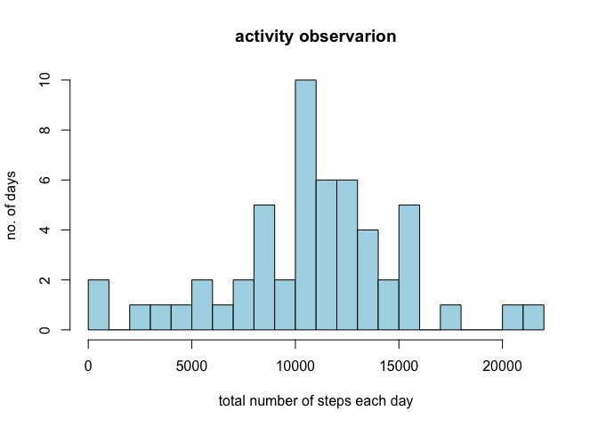
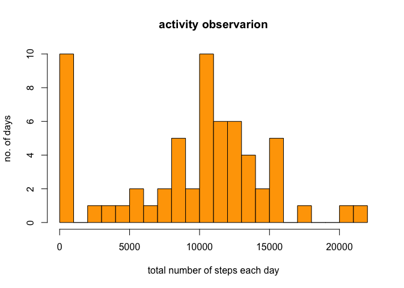
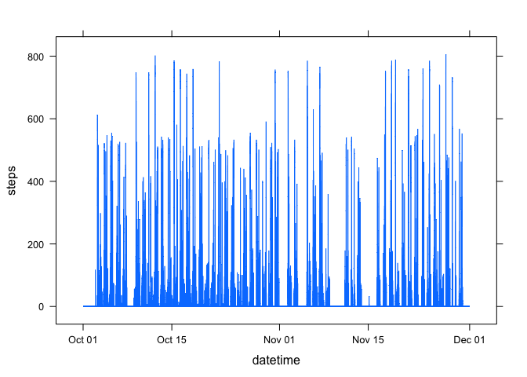
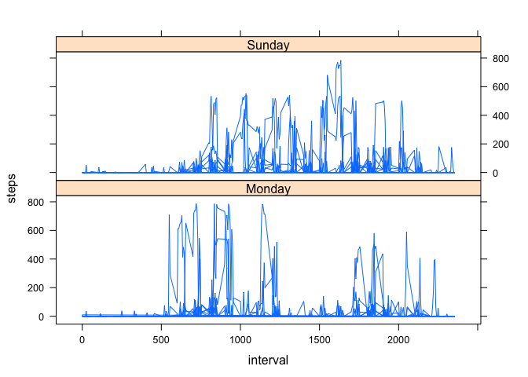

# Reproducible Research: Peer Assessment 1


## Loading and preprocessing the data
First unzip and load the data into an R object

```r
unzip("activity.zip")
raw_data <- read.csv("activity.csv", header=TRUE)
summary(raw_data)
```

```
##      steps                date          interval     
##  Min.   :  0.00   2012-10-01:  288   Min.   :   0.0  
##  1st Qu.:  0.00   2012-10-02:  288   1st Qu.: 588.8  
##  Median :  0.00   2012-10-03:  288   Median :1177.5  
##  Mean   : 37.38   2012-10-04:  288   Mean   :1177.5  
##  3rd Qu.: 12.00   2012-10-05:  288   3rd Qu.:1766.2  
##  Max.   :806.00   2012-10-06:  288   Max.   :2355.0  
##  NA's   :2304     (Other)   :15840
```
Total number of data in csv

```r
total<-nrow(raw_data)
```
is 17568


## What is mean total number of steps taken per day?
For this task ,ignore the missing values and store the complete data in activity_data object

```r
good <-complete.cases(raw_data)
activity_data <-subset(raw_data,good)
total_steps <-aggregate(steps~date,activity_data,sum)
hist(total_steps$steps,breaks=20,col="lightblue",main="activity observarion", xlab="total number of steps each day",ylab="no. of days")
```

 
summary

```r
summary <-summary(total_steps$steps)
summary
```

```
##    Min. 1st Qu.  Median    Mean 3rd Qu.    Max. 
##      41    8841   10760   10770   13290   21190
```
The mean of the total number of steps is 10760 and the median is 
10770


## What is the average daily activity pattern?


## Imputing missing values

Split the missing observation

```r
missing_data <-subset(raw_data,!good)
missing <-nrow(missing_data)
clean_data <-rbind(activity_data, transform(missing_data,steps=0))
total_steps <-aggregate(steps~date,clean_data,sum)
hist(total_steps$steps,breaks=20,col="orange",main="activity observarion", xlab="total number of steps each day",ylab="no. of days")
```

 
The total number of missing data is **2304**  


## Are there differences in activity patterns between weekdays and weekends?

Transorm to get datetime

```r
activity_time <-transform(clean_data,datetime= strptime(paste(date,formatC(interval, width = 4, format = "d", flag = "0")),"%Y-%m-%d %H%M"))
library(lattice)
xyplot(steps~datetime, data=activity_time, type="l")
```

 
Average steps

```r
avg_steps_by_weekday <- transform(activity_time, weekday2 = factor(weekdays(datetime)))
weekend <-subset(avg_steps_by_weekday, weekday2=="Sunday")
week <-subset(avg_steps_by_weekday, weekday2=="Monday")

avg_steps <-aggregate(steps~interval,avg_steps_by_weekday,mean)
xyplot(steps~interval| weekday2, data=rbind(weekend,week), layout=c(1,2), type="l")
```

 
